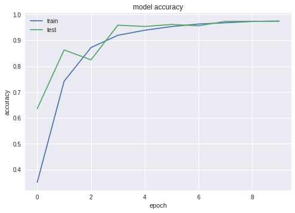
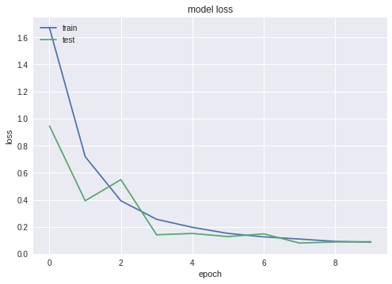
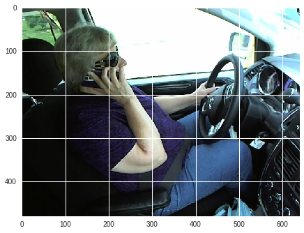

# Distracted_Driver_Detection
Distracted Driver Detection is one project from kaggle competition which you can find detail [here](https://www.kaggle.com/c/state-farm-distracted-driver-detection#description).I downloaded the data and utilized transfer-learning according to pre-trained VGG19 model on ImageNet. After 10 batches, the accurate reached close to 97%.

## Data structure
Basicly, the data alrealy labeled into 10 different statues, from C0 to C9.

- c0: normal driving
- c1: texting - right
- c2: talking on the phone - right
- c3: texting - left
- c4: talking on the phone - left
- c5: operating the radio
- c6: drinking
- c7: reaching behind
- c8: hair and makeup
- c9: talking to passenger

**Step 1**: the first setp is simple, download the raw data from google drive and unzip the image folder. This might take a while since the image zip file are almost 4Gb. Compressed raw data :https://drive.google.com/file/d/1OA94GnqYDD9O4NPxepRot4-whIYYC62S/view?usp=sharing
 Plus: you will love Google components, the uncompress process is super faster than your own pc.

- *driver_imgs_list.csv* is the label information. 
- *imgs* is the folder for storing images by classifications
    - *train* folder: with subfolders named after 10 categories.
    - *validation* folder: this is folder I created by myself, stratified extract 25% samples from training folder.
    - *test* folder: I didn't use it for validation since I dont know the labels. 
- *sample_submission.csv* is the submission format, just leave it alone.

To understand more information about folder structure, and how it works with `ImageDataGenerator` in keras, please click [here](https://medium.com/@vijayabhaskar96/tutorial-image-classification-with-keras-flow-from-directory-and-generators-95f75ebe5720).

*Step 2*: Before we do any data analysis, we need to overview the whole dataset, such as distribution of samples or take a peek of images by each classification.

The number of each category shows they are balance. Otherwise, wehave to rebalance samples by `ADASYN` or `SMOTE`.

*Step 3*: we will use a** Convolution Neural Network** for the task. However, we don't have to train a new VGG19 from begining. Alternatively, we will freeze 1-5 layer(cov layers), and only add our FC layers for training. The output is probability of each category by softmax.After 10 epoches, the accurate reached 97%.

`
Epoch 00009: val_acc improved from 0.97342 to 0.97360, saving model to vgg19_1.h5
Epoch 10/10
1052/1052 [==============================] - 170s 162ms/step - loss: 0.0877 - acc: 0.9748 - val_loss: 0.0906 - val_acc: 0.9738
Epoch 00010: val_acc improved from 0.97360 to 0.97378, saving model to vgg19_1.h5
`

You can download h5 file from [here](https://drive.google.com/open?id=1nvpcoyH2CbDpPDJn5uuxFAd8CjkJyfc8)

*Accurate*

*Loss*

**Step 4**: Now, we have created our model already. Since kaggle didn't provide labels for test group, we cannot get a result from it. However, it is still possible to randomly pick some images to have our prediction testing.

*Oringal image*

*Resize to 48 by 49 pixels*

The result as blew:
array([[0., 0., 1., 0., 0., 0., 0., 0., 0., 0.]], dtype=float32), which means C2=1, which is talking on the phone - right.
